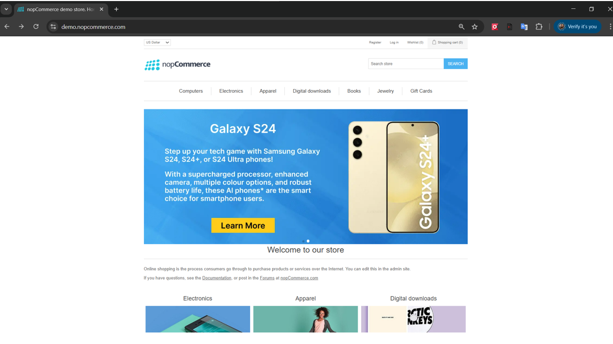
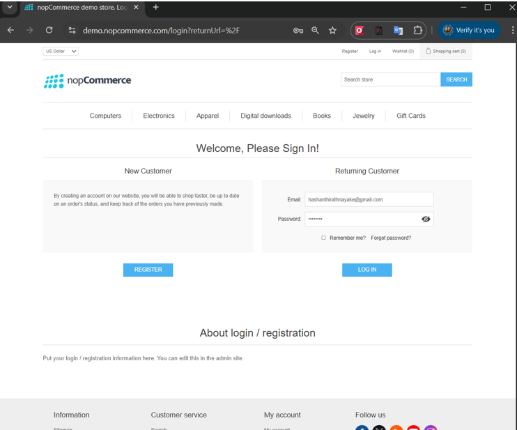

# 🧪 Robot Framework Automation – Login Test (nopCommerce)

This project demonstrates automated UI testing of a login functionality using **Robot Framework** and **SeleniumLibrary** on the nopCommerce demo website.

---

## 🌐 Application Under Test

🔗 https://demo.nopcommerce.com/

---

## 🎯 Objective

To automate and validate the login functionality of the nopCommerce web application using Robot Framework.

---

## 🧰 Tech Stack

* Python 
* Robot Framework
* SeleniumLibrary
* Chrome Browser

---

## 📁 Project Structure

```
Robotic-Framework/
│
├── TestCases/
│   └── TC1.robot
│
├── images/
│   └── homepage.png
│
├── README.md
├── main.py
└── test1.py
```

---


## 🖼️ Application Screenshots

### 🏠 Home Page


### 🔐 Login Page



## ▶️ How to Execute Tests

Run the following command:

```
robot TestCases/TC1.robot
```

---

## 🧪 Test Case: Login Functionality

### ✅ Test Steps

1. Open browser and navigate to the application
2. Click on **Login** link
3. Enter email and password
4. Click **Login** button

---

